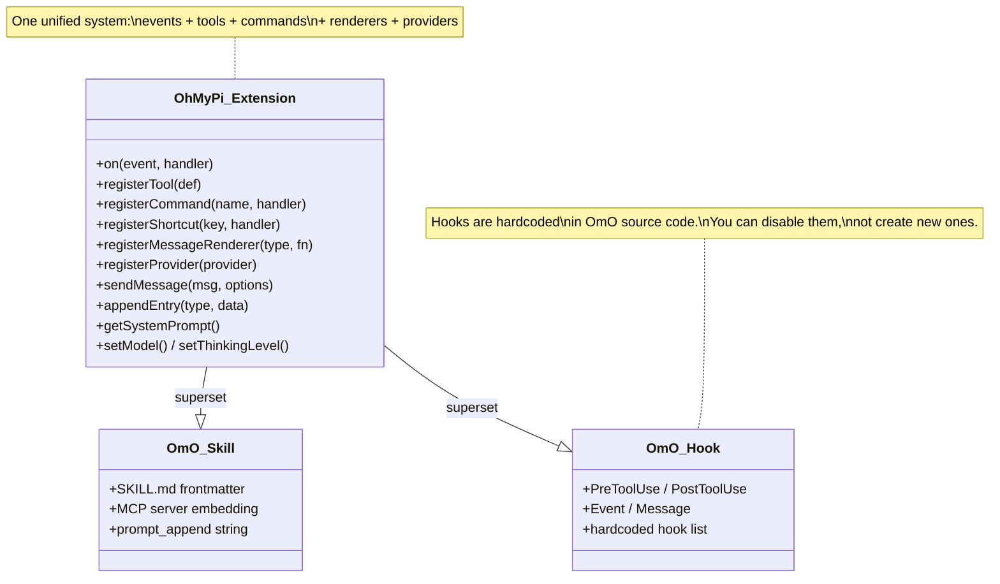
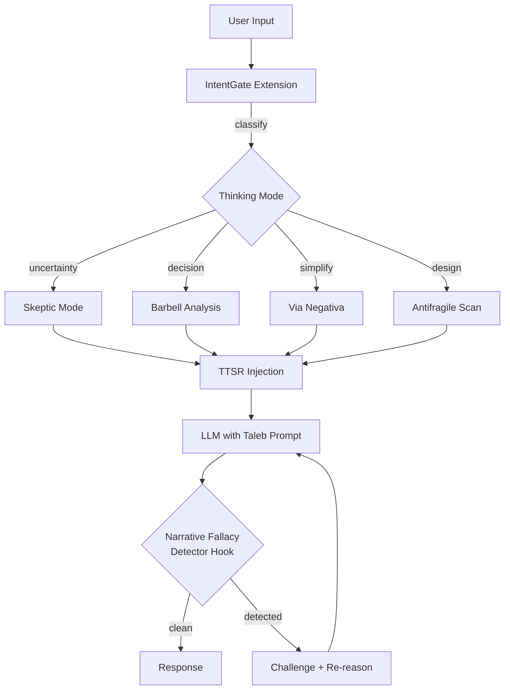

## You're Right: Oh-My-OpenAgent Has Brilliant Ideas to Steal

The mechanisms you identified are genuinely innovative for a thinking agent:

| OmO Mechanism | What It Does | Value for Taleb-Pi |
|---|---|---|
| **System Prompt Injection** | Every agent gets domain-specific system prompts injected at runtime via `prompt_append` and `file://` loading | Core -- you'd inject Taleb's frameworks as the *default worldview*, not an optional skill |
| **IntentGate** | Classifies user's *true intent* before acting (research? decision? implementation?) | Essential -- Taleb would say "what kind of uncertainty are you facing?" before reasoning |
| **Mode Markers** | Agents operate in distinct modes (ultrawork, prometheus planning, atlas execution) | Maps perfectly to Taleb thinking modes: skepticism mode, barbell analysis mode, via negativa mode |
| **Category System** | Routes tasks to different models by *nature of work* | Could route "fat-tail problems" to deep reasoning models, "quick heuristics" to fast ones |
| **Todo Enforcer / Ralph Loop** | Yanks idle agents back to work, forces completion | For thinking: forces you to actually *resolve* your analysis, not just hand-wave |
| **Hooks (25+)** | Event-driven interceptors that modify behavior at every stage | Could add a "narrative fallacy detector" hook that fires on every reasoning step |

---

## The Core Question: Oh-My-Pi vs Oh-My-OpenAgent as Base

### Oh-My-Pi is the better choice. Here's why:

**1. Oh-My-Pi is a standalone agent; OmO is a plugin on OpenCode**

```
Oh-My-Pi:     Your code → runs directly
OmO:          OpenCode runtime → OmO plugin → your customization
```

OmO is a plugin for the OpenCode harness. You'd be building a plugin-on-a-plugin. Every OmO update could break your customization. Every OpenCode update could break OmO. Two layers of dependency for a "fully customized" agent is the opposite of what you want.

Oh-My-Pi is a fork of Pi (badlogic/pi-mono) that runs as its own binary. You own the full stack.

**2. Oh-My-Pi's extension system is strictly more powerful**



Oh-My-Pi extensions can do *everything* OmO's skills + hooks do, plus:
- Register custom **tools** the model can call (e.g., a `fragility_scan` tool)
- Intercept **any event** (tool_call, tool_result, session_start, turn_start, etc.)
- **Block or modify** tool execution (fail-closed middleware)
- Custom **UI components** and message renderers
- **Session state persistence** via `appendEntry`
- **Provider registration** -- add custom LLM providers

OmO's hooks are **hardcoded in source** (comment-checker, todo-enforcer, etc.). You can *disable* them but you can't create new ones without forking OmO itself. OmO's skills are markdown injection -- powerful but passive.

**3. Oh-My-Pi's philosophy aligns with Taleb's Via Negativa**

Pi's philosophy (from its README):
- "No MCP" / "No sub-agents" / "No plan mode" / "No permission popups" -- build exactly what you need
- "Aggressively extensible so it doesn't have to dictate your workflow"
- Minimal core, maximum customization surface

This *is* Via Negativa. Strip away the unnecessary, keep only what you need. OmO's philosophy is the opposite: "Install. Type `ultrawork`. Done." -- maximal defaults, everything baked in.

For a "fully customized" thinking agent, you want the minimal core (Oh-My-Pi) not the maximal defaults (OmO).

**4. Oh-My-Pi has features OmO lacks that matter for thinking**

| Feature | Oh-My-Pi | OmO |
|---|---|---|
| **Python REPL tool** | Built-in | No |
| **Rust native engine** | Yes (pi-natives, N-API) | No (pure JS/Bun) |
| **TTSR injection** | Yes (turn-level system prompt injection) | No |
| **Subagent roles** | explore, plan, designer, reviewer, task, quick_task | Sisyphus, Hephaestus, etc. (hardcoded) |
| **Blob artifacts** | Built-in | No |
| **Session tree branching** | Full JSONL tree | Yes (inherited from OpenCode) |

TTSR (Turn-level Transient System Reminder) is particularly interesting -- it injects system-level context *per turn*, which is exactly how you'd implement dynamic Taleb-style reasoning modes that shift based on the conversation.

---

### What Oh-My-Pi lacks (that you'd need to build)

These are the OmO ideas worth stealing and implementing as Oh-My-Pi extensions:

**1. IntentGate as an Extension**
```typescript
// Intercept every user input, classify intent before routing
pi.on("input", async (event, ctx) => {
  const intent = classifyTalebIntent(event.content);
  // "decision_under_uncertainty" | "narrative_check" | "system_fragility" | ...
  ctx.setThinkingLevel(intent.thinkingLevel);
  // inject appropriate Taleb framework into system prompt
});
```

**2. Mode System as Extension State**
```typescript
// Taleb thinking modes, persisted via appendEntry
pi.on("session_start", async (_, ctx) => {
  // Restore mode from session history
  for (const entry of ctx.sessionManager.getBranch()) {
    if (entry.customType === "taleb-mode") currentMode = entry.data;
  }
});
pi.registerCommand("mode", {
  handler: async (args, ctx) => {
    // Switch between: skeptic, barbell, via-negativa, antifragile-scan
  }
});
```

**3. Narrative Fallacy Detector as a Hook**
```typescript
pi.on("tool_result", async (event) => {
  // After every reasoning step, check for narrative fallacy patterns
  // Inject warning if detected
});
```

**4. Category-like Routing**
Oh-My-Pi's subagent task system already has roles (explore, plan, reviewer, etc.). You'd add Taleb-specific roles.

---

### Why NOT Oh-My-Pi (the honest counterarguments)

| Concern | Severity | Mitigation |
|---|---|---|
| **Smaller community** than OmO | Medium | Oh-My-Pi is a can1357 fork of Pi which has a large community |
| **More work upfront** | High | You build more from scratch; OmO gives you batteries-included |
| **No built-in multi-model orchestration** | Medium | Pi supports 30+ providers; add routing via extension |
| **Written in TS + Rust** | Low | Extensions are pure TS; Rust is only for the native engine |
| **OmO's "discipline enforcement"** (ralph loop, todo enforcer) is battle-tested | Medium | Reimplement the ones you need as extensions |

---

## Recommendation

**Use Oh-My-Pi as the base.** Build a single extension package (`taleb-pi`) that:

1. **Replaces the system prompt** with Taleb's worldview as the default reasoning framework
2. **Registers custom tools**: `fragility_scan`, `barbell_analysis`, `premortem_taleb`, `convexity_check`
3. **Implements IntentGate** via the `input` event (stolen from OmO's concept)
4. **Adds thinking modes** via slash commands: `/skeptic`, `/barbell`, `/via-negativa`, `/antifragile`
5. **Hooks into `tool_result`** for narrative fallacy detection and reasoning quality checks
6. **Uses TTSR** for per-turn dynamic context injection based on conversation state



This gives you:
- OmO's best ideas (IntentGate, modes, system prompt injection, discipline enforcement)
- Oh-My-Pi's power (full extension API, TTSR, custom tools, provider control)
- No plugin-on-plugin dependency hell
- A truly *fully customized* agent, not a config file on someone else's opinionated framework
